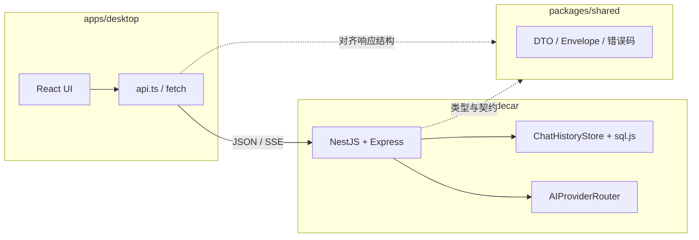

# 项目概览（ABOUT）

本文档帮助快速了解 **Practical AI Agent** 的工程形态、前后端分工与主要技术选型。更细的功能说明见 [`docs/FEATURES.md`](docs/FEATURES.md)，接口见 [`docs/API.md`](docs/API.md)。

---

## 1. 整体定位

- **形态**：pnpm **Monorepo**，本地优先的聊天 + 知识库（RAG MVP）骨架。
- **当前运行方式**：浏览器中的 **React + Vite** 前端，通过 **HTTP** 调用本机 **NestJS Sidecar**；**不依赖** Rust/Tauri 编译（README 中明确为 MVP 范围）。
- **数据**：会话与消息、用户与认证、知识文档与分块等，落在 Sidecar 进程内的 **SQLite（`sql.js` 内存 + 文件持久化）**。

---

## 2. 仓库结构

| 路径 | 角色 |
|------|------|
| `apps/sidecar` | 本地 API 服务（NestJS），聊天、知识库、认证、健康检查 |
| `apps/desktop` | 聊天与知识库管理界面（React + Vite） |
| `packages/shared` | 前后端共享：**Envelope** 响应包装、聊天/AI DTO、错误码等 |
| `docs/` | 功能清单、API、运行说明 |

根目录 `pnpm dev` 会并行启动 Sidecar（默认 **3001**）与 Desktop（默认 **5173**）。

---

## 3. 后端架构（Sidecar）

### 3.1 技术栈

- **运行时**：Node.js + **TypeScript**
- **框架**：**NestJS**（`@nestjs/common` / `core` / `platform-express`）
- **HTTP**：Express（由 Nest 托管），大体积 JSON 解析上限约 25MB，开发环境开启 **CORS**
- **配置**：**dotenv**，启动时在若干候选路径中查找仓库根目录 `.env`
- **数据库**：**`sql.js`**（WASM SQLite），无原生 `better-sqlite3` 等编译依赖；路径由 `SQLITE_PATH` 等环境变量控制
- **AI**：`AIProviderRouter` 统一路由（如 **mock**、**DeepSeek** 等，由环境变量选择）

### 3.2 模块划分（`app.module.ts`）

- **`HealthModule`**：健康检查等运维向接口
- **`ChatModule`**：挂载 **聊天** 与 **知识库** 相关控制器（`ChatController` + `KnowledgeController`）
- **`AuthModule`**：注册、登录、`/me`、主题与个人信息等

业务核心在 **`ChatService`**（会话、消息、发送/流式、RAG 检索注入）、**`ChatHistoryStore`**（SQLite 访问）、**`AIProviderRouter`**（调用具体模型）。

### 3.3 API 与契约

- 成功/失败统一为 **Envelope**：`{ ok, code, data? }` 或 `{ ok: false, code, message, retryable, ... }`（与 `packages/shared` 对齐）
- 需登录的接口通过 **`Authorization: Bearer <token>`** 校验用户
- 流式回复使用 **SSE** 风格（如 `/chat/stream`），前端在 `api.ts` 中解析 `event` / `data` 分块

---

## 4. 前端架构（Desktop）

### 4.1 技术栈

- **UI**：**React 18** + **TypeScript**
- **构建**：**Vite**（`@vitejs/plugin-react`），开发服务器默认 **5173**，`--host 0.0.0.0` 便于局域网访问
- **样式**：**全局 CSS**（`styles/global.css`，如 `.wx-btn`、`.wx-input`）+ **CSS Modules**（如 `app-layout.module.css` 等页面级布局）
- **客户端能力（知识相关）**：**mammoth**（Word）、**pdfjs-dist**（PDF）、**tesseract.js**（OCR），用于在浏览器侧解析上传文件再交给 Sidecar 入库（与 `parse-knowledge-file` 等工具配合）

### 4.2 组件与页面组织方式

- **入口**：`main.tsx` 挂载 **`AppRoot`**
- **`AppRoot`**：`RouterProvider` + `AuthProvider`，根据登录态在 **`AuthPage`** 与已登录主界面间切换
- **路由**：轻量 **`history.pushState` / `popstate`** 封装在 `modules/routing/router.tsx`（非 react-router），路径如 `/auth`、`/chat`、`/knowledge`、`/settings`
- **主壳**：**`AppLayout`** 组合侧栏、聊天区、知识入库卡片、知识管理页、设置/个人资料等，并协调 **`useChatModule`** 与 **`useKnowledgeModule`**
- **展示组件**（按功能分目录）：
  - `components/layout/`：如会话侧栏
  - `components/chat/`：聊天消息与输入区
  - `components/knowledge/`：入库卡片、文档管理
- **业务状态**：以 **自定义 Hooks** 为主（`use-chat-module.ts`、`use-knowledge-module.ts`），内部调用 **`api.ts`** 中的 `fetch` 封装；聊天侧使用 **`chat-sync.ts`** 的广播/订阅在同页多组件间同步部分状态

整体上属于 **「页面容器 + 功能 Hooks + 无状态/弱状态展示组件」**，未使用重型状态管理库。

### 4.3 与后端的连接

- 基地址：**`import.meta.env.VITE_SIDECAR_URL`**，默认开发时常为 `http://localhost:3001`（与 README 一致）
- Token 存 **`localStorage`**，请求头自动带 Bearer
- 普通请求返回 JSON Envelope；流式聊天单独走 **`ReadableStream`** 解析 SSE

---

## 5. 共享包（`@ai-agent/shared`）

- 导出 **Envelope**、**错误码**、**聊天/AI 相关 DTO** 等，保证 Sidecar 与 Desktop 对请求/响应形状一致
- Sidecar 构建前会通过 workspace 依赖引用；Desktop 主要在前端自行对齐类型，共享包更偏「契约与复用」

---

## 6. 技术清单速查

| 类别 | 技术 |
|------|------|
| 包管理 / Monorepo | **pnpm** workspace |
| 后端框架 | **NestJS** + Express |
| 前端框架 | **React** + **Vite** |
| 语言 | **TypeScript**（全栈） |
| 本地数据库 | **sql.js**（SQLite） |
| AI 接入 | 自研 **`AIProviderRouter`**（环境变量切换 provider） |
| 知识文件（前端解析） | **mammoth**、**pdfjs-dist**、**tesseract.js** |
| Sidecar 开发运行 | **tsx** watch |

---

## 7. 与文档/技能的关系

- 仓库内 **`.cursor/skills/`** 描述了与「AI 路由、编排、历史存储、知识检索、Tauri 能力桥」等相关的**目标架构与约定**；当前 MVP 代码已落地其中一部分（如本地 API、Envelope、聊天与知识库雏形），Tauri 集成仍为规划向能力。
- 深入 API 与表结构请以 **`docs/`** 为准。

---

*若本文件与代码不一致，以代码与 `docs/` 为准；欢迎随迭代更新本页。*
